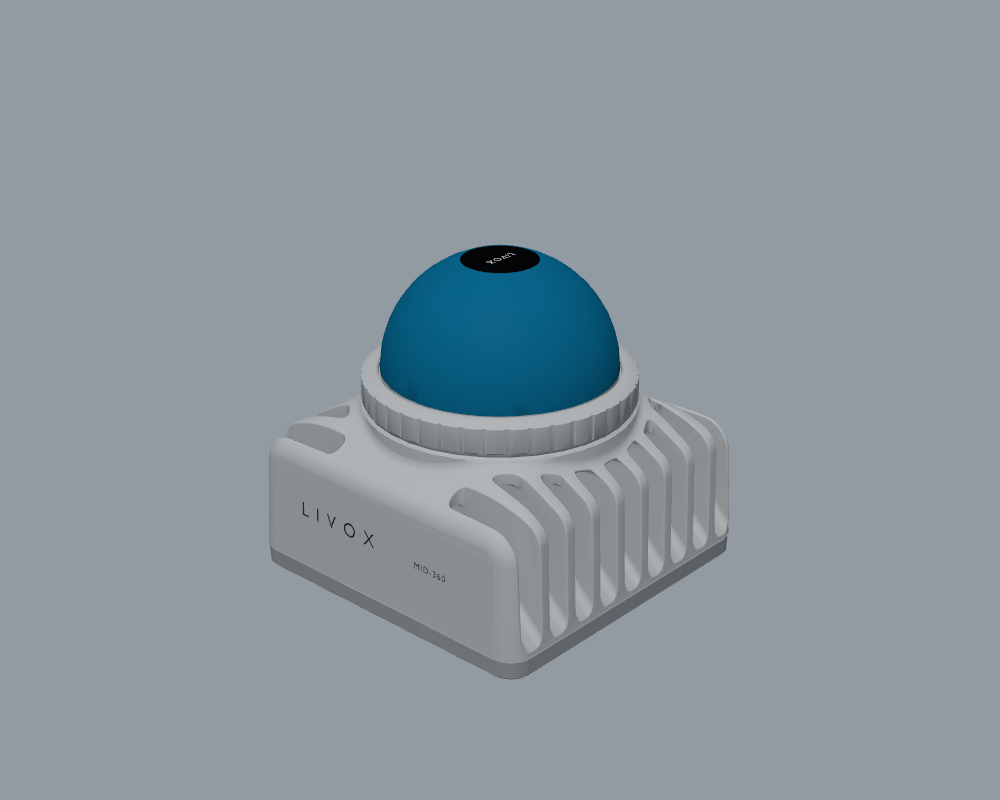
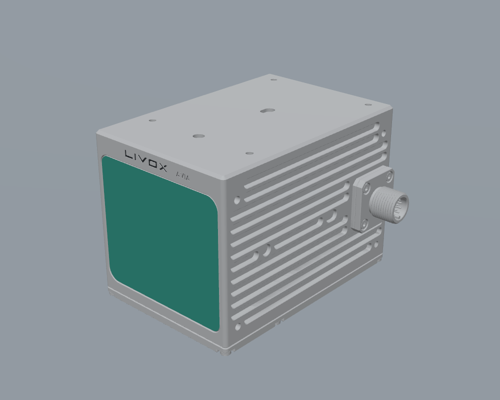
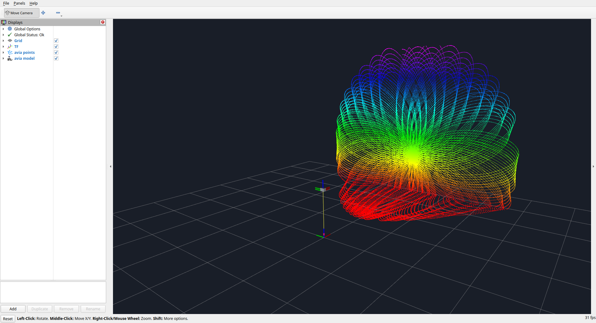

# Livox LiDAR Simulation for Gazebo

An unofficial RGL-based Livox simulator for **MID-360, Avia, ROS 2 Jazzy and Gazebo Harmonic**.

Detailed models, GPU point clouds, IMU and TF, with single-sensor, dual-sensor and moving demos. Use it as a standalone ROS package or a Git submodule. Version: 0.1.0 prerelease.

[中文](README.md) · [Integration](docs/INTEGRATION.md) · [Supported features](docs/SUPPORT.md) · [Troubleshooting](docs/TROUBLESHOOTING.md)

## Preview

Default DAE models rendered in Gazebo:

| MID-360 | Avia |
|:---:|:---:|
|  |  |

Avia scan pattern displayed in RViz, colored by height:



| Model | Rays per frame | Point cloud rate | IMU rate | Simulated range |
|---|---:|---:|---:|---:|
| MID-360 | 20,000 | 10 Hz | 200 Hz | 0.1–40 m |
| Avia | 24,000 | 10 Hz | 200 Hz | 0.1–190 m |

Rates use simulation time; only ray hits are published. DAE is the default appearance format; [optional PBR GLB assets](docs/INTEGRATION.md#可选-glb-外观) are also included.

## Quick start

**Ubuntu 24.04 x86_64, ROS 2 Jazzy, Gazebo Harmonic and an NVIDIA GPU are required.** There is no CPU simulation backend.

```bash
git clone https://github.com/tianze-dev/livox_lidar_simulation_gz.git
cd livox_lidar_simulation_gz
source /opt/ros/jazzy/setup.bash

# Install declared dependencies; rosdep must already be initialized
rosdep install --from-paths . --ignore-src -r -y
bash scripts/check_environment.sh
python3 scripts/fetch_dependencies.py
bash scripts/build.sh
source install/local_setup.bash

# Launch MID-360 with Gazebo and RViz
bash scripts/run.sh
```

RGL dependencies are version-pinned and SHA256-checked, with a local cache in `.deps/rgl`. See [troubleshooting](docs/TROUBLESHOOTING.md) for offline use, custom cache paths and installation issues.

## Demos

Run from the repository root, one demo at a time:

```bash
# Avia
bash scripts/run.sh model:=avia name:=avia
# Close-up model view
bash scripts/run.sh model_view:=true
# Moving rail and turntable
bash scripts/run.sh moving:=true
# MID-360 + Avia
bash scripts/run.sh sensors_file:=config/demos/mixed.yaml
# Headless
bash scripts/run.sh gui:=false rviz:=false
```

Default topics are `/livox/<name>/points` (PointCloud2) and `/livox/<name>/imu` (Imu), alongside `/clock` and TF. The wrapper defaults to ROS domain 119; set `ROS_DOMAIN_ID` to avoid conflicts with other simulations or hardware.

## Robot integration

This example mounts one MID-360 on an existing robot's `base_link`. The robot should already have a working Gazebo world, spawn workflow and `robot_state_publisher`; this package does not replace the robot launch.

### 1 Add the package to your workspace

Run from the robot workspace root. Skip cloning if the package is already included as a submodule:

```bash
git clone https://github.com/tianze-dev/livox_lidar_simulation_gz.git src/livox_lidar_simulation_gz
source /opt/ros/jazzy/setup.bash
rosdep install --from-paths src --ignore-src -r -y
python3 src/livox_lidar_simulation_gz/scripts/fetch_dependencies.py
colcon build --symlink-install
source install/setup.bash
```

Declare `<exec_depend>livox_lidar_simulation_gz</exec_depend>` in the robot description package's `package.xml`. Source the same workspace in the terminals used for Gazebo, the robot and bridges, and use matching `ROS_DOMAIN_ID` and `GZ_PARTITION` settings.

### 2 Mount the sensor in the robot Xacro

Add the following inside the existing robot's `<robot xmlns:xacro="http://www.ros.org/wiki/xacro">` element:

```xml
<xacro:include filename="$(find livox_lidar_simulation_gz)/urdf/livox.xacro"/>

<xacro:livox_lidar
  parent="base_link"
  name="front"
  namespace="robot"
  model="mid360"
  xyz="0.1 0 0.4"
  rpy="0 0 0"/>
```

| Parameter | Meaning |
|---|---|
| `parent` | Existing parent link, here `base_link` |
| `name` | Instance name and link/TF prefix; each sensor must have a unique name |
| `namespace` | Topic namespace; this example generates `/robot/front/points` and `/robot/front/imu` |
| `model` | `mid360` or `avia` |
| `xyz`, `rpy` | Pose of the sensor mounting-bottom center relative to the parent, in meters/radians; adjust to your installation |
| `points_topic`, `imu_topic` | Gazebo output topics; these must match the bridge below |

The macro includes visuals, collision, inertia, fixed joints, lidar and IMU. Default topics follow `namespace/name`. To override them, pass matching `points_topic` and `imu_topic` values to both the macro and bridge, e.g. `points_topic:=/sensors/cloud imu_topic:=/sensors/imu`.

### 3 Enable the Gazebo world systems

Add these plugins inside the robot world's SDF `<world>` element, keeping its existing Physics, UserCommands and other systems. Use one instance of each plugin per world, not per sensor:

```xml
<plugin filename="RGLServerPluginManager"
        name="rgl::RGLServerPluginManager">
  <do_ignore_entities_in_lidar_link>true</do_ignore_entities_in_lidar_link>
</plugin>

<plugin filename="gz-sim-imu-system"
        name="gz::sim::systems::Imu"/>
```

Use your robot's existing launch workflow to load this world, expand the modified Xacro and spawn the robot. Give `robot_state_publisher` the same complete robot description. Do not launch this package's `demo.launch.py` alongside the robot.

### 4 Bridge the sensor to ROS 2

In another terminal with the parent workspace sourced:

```bash
ros2 launch livox_lidar_simulation_gz sensor.launch.py \
  model:=mid360 name:=front namespace:=robot bridge_clock:=false
```

This bridges Gazebo `/robot/front/points` and `/robot/front/imu` to identically named ROS 2 topics, in the Gazebo-to-ROS direction. If the parent does not bridge `/clock`, set `bridge_clock:=true`; keep only one clock bridge for the simulation.

When bridging the clock, prefer `clock_topic:=/world/YOUR_WORLD_NAME/clock`; the ROS output remains `/clock`.

| ROS 2 topic | Type | frame_id | Rate |
|---|---|---|---:|
| `/robot/front/points` | `sensor_msgs/msg/PointCloud2` | `front_lidar` | 10 Hz |
| `/robot/front/imu` | `sensor_msgs/msg/Imu` | `front_imu` | 200 Hz |

The robot's `robot_state_publisher` publishes the fixed transforms `base_link → front_body` and `front_body → front_lidar/front_imu`. The parent provides dynamic transforms such as `odom → base_link`. Set `use_sim_time:=true` on RViz and algorithm nodes.

In RViz, add PointCloud2, select `/robot/front/points` and use `base_link` or an existing `odom` as the Fixed Frame. For Avia, change `model` to `avia` in both the macro and bridge command. See the [integration guide](docs/INTEGRATION.md) for custom meshes, GLB and additional options.

The simulator uses whole-frame snapshots and an ideal IMU. Per-point timing, motion distortion, CustomMsg and FAST-LIVO2 integration are not provided. MID-360 extrinsics use manufacturer nominal values; Avia extrinsics are approximations. See [support details](docs/SUPPORT.md) for parameters and limitations.

## Tests and contributions

```bash
bash scripts/check.sh --unit       # Unit tests and initialization fault injection
bash scripts/check.sh --gpu        # GPU runtime regression
bash scripts/check.sh --endurance  # Stability checks
```

`--gpu` includes a separately built parent robot workspace, mounting, bridges, TF and reset checks. Run `python3 scripts/release_check.py` for technical checks; add `--release` to fail on unresolved distribution reviews.

See [CONTRIBUTING.md](CONTRIBUTING.md) for development guidelines. Original code is licensed under [Apache-2.0](LICENSE); third-party code and models retain their [own notices](THIRD_PARTY_NOTICES.md). Public redistribution terms for the Avia CAD-derived assets remain unconfirmed.
